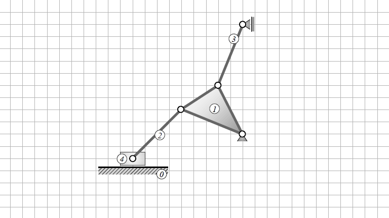

# ***Aufgabe 1***:
---
## Getriebesystematische Betrachtung und Polermittlung
---
### Ermitteln Sie für den dargestellten Mechanismus
_a)_ den Gesamtfreiheitsgrad
 
_b)_ die Anzahl der Maschen
 
_c)_ die zugehörige kinematische Kette (Skizze)
 
_d)_ alle Absolut- und Relativpole (graphisch)
 
_e)_ die Übersetzung $i_{3,1}$
 

## _Lösung:_
### zu _a) Gesamtfreiheitsgrad:_
Im Aufgabenteil a) ist nach dem Gesamtfreiheitsgrad "$F$" gefragt.  
Dieser wird nach Grübler mit folgender Formel berechnet:

---

$$F=3*(n-1)-b_1-2*b_2$$

---

"$n$" ist hierbei die Gliederzahl, "$b_{1}$" ist die Anzahl einwertiger und "$b_{2}$" die Anzahl zweiwertiger Gelenke.
 
Die Gliederanzahl setzt sich aus den Gliedern 0, 1, 2, 3 und 4 zusammen. Das erste Glied wird als Fläche dargestellt, da es mehr als zwei Gelenkverbindungen besitzt.
 
Das Loslager oben ist ein einwertiges Gelenk und somit auch das einzige in diesem Mechanismus.
 
Bei den zweiwertigen Gelenken sind wir bei einer Anzahl $b_{2}$=5. Hierzu wird zunächst das Festlager an der rechten Seite und die Verbindung zwischen Schubkurbel (4) und Umgebung gezählt.  
 Die restlichen drei Gelenke sind in den Verbindungen der Glieder zwischen 
 
4  &rarr; 2, 2 &rarr; 1, und 1 &rarr; 3 zu finden.
 

_Somit ergibt sich für die Formel:_

---
>$$F=3*(5-1)-1-2*5 = 1$$
---

### zu _b) Anzahl der Maschen:_
Für die Maschenregel gilt folgende Gleichung: 

---
$$m=b_1+b_2-n+1$$
---

Die Beziehung der Variablen aus Teilaufgabe _a)_ gelten auch hier. Somit ist die Anzahl der Maschen $"m"$:

---
>$$m=1+5-5+1 = 2$$
---

### zu _c) Kinematische Kette:_

Hier geht man systematisch vor. Zunächst schaut man nach dem Gestellglied (Umgebung), dieses wird mit dem Index "$0$" versehen. Man kann erkennen, dass die Umgebung mit den Gliedern 3, 4 und 1 verbunden sind. Somit können wir es als Dreieck darstellen. Das Loslager 3 ist ein einwertiges Gelenk und wird mit einem durchgestrichenen Kreis gekennzeichnet, zweiwertige Gelenke mit einem einfachen Kreis. Desweiteren können wir sehen, dass das 1. Glied drei Gelenke hat und können es auch als Dreieck darstellen. Wir sehen, dass 1 zusätzlich mit 2 und 3 verbunden sein muss. Glied 2 muss auch mit Glied 4 verbunden sein. Somit entsteht folgende kinematische Kette:

